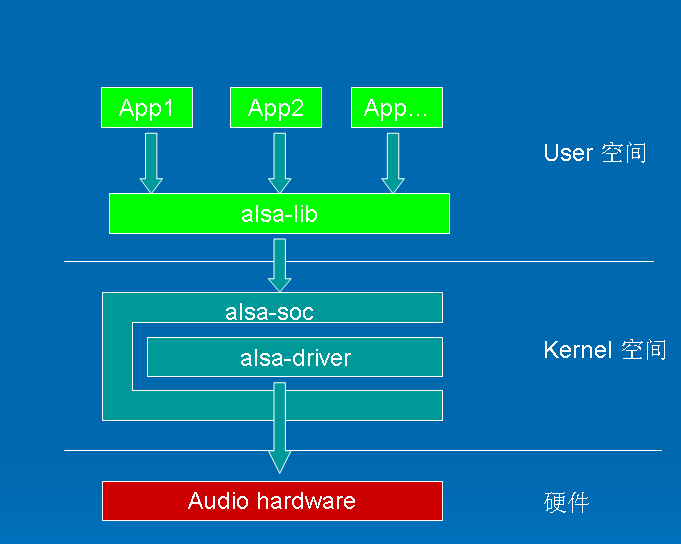
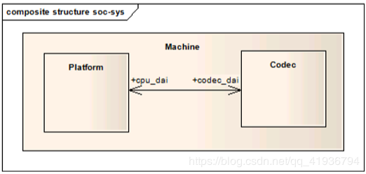

一.  ALSA

    ALSA是Advanced Linux Sound Architecture 的缩写，目前已经成为了linux的主流音频体系结构，想了解更多的关于ALSA的这一开源项目的信息和知识，请查看以下网址：http://www.alsa-project.org/。

    在内核设备驱动层，ALSA提供了alsa-driver，同时在应用层，ALSA为我们提供了alsa-lib，应用程序只要调用alsa-lib提供的API，即可以完成对底层音频硬件的控制。

由图1.1可以看出，用户空间的alsa-lib对应用程序提供统一的API接口，这样可以隐藏了驱动层的实现细节，简化了应用程序的实现难度。内核空间中，alsa-soc其实是对alsa-driver的进一步封装，他针对嵌入式设备提供了一些列增强的功能。本系列博文仅对嵌入式系统中的alsa-driver和alsa-soc进行讨论。

# alsa

# ALSA SoC层概述

ALSA片上系统（ASoC）层的总体项目目标是为嵌入式片上系统处理器（例如pxa2xx，au1x00，iMX等）和便携式音频编解码器提供更好的ALSA支持。在ASoC子系统之前，内核中已经对SoC音频提供了一些支持，但是它具有一些局限性：

> - 编解码器驱动程序通常与底层SoC CPU紧密耦合。这并不理想，并且会导致代码重复-例如，Linux针对4个不同的SoC平台具有不同的wm8731驱动程序。
> - 没有标准的方法来发信号通知用户启动的音频事件（例如，插入耳机/麦克风，插入事件后检测耳机/麦克风）。这些是便携式设备上非常常见的事件，在此类事件发生后，通常需要机器特定的代码来重新路由音频，启用放大器等。
> - 在播放（或录制）音频时，驱动程序倾向于打开整个编解码器的电源。这对于PC来说很好，但是会在便携式设备上浪费很多功率。还不支持通过更改编解码器过采样率，偏置电流等来节省功耗。

       ASoC把音频系统同样分为3大部分：Machine，Platform和Codec

        Platform  一般是指某一个SoC平台，比如MT6582, MT6595, MT6752等等，与音频相关的通常包含该SoC中的Clock、FAE、I2S、DMA等等,该模块负责DMA的控制和I2S的控制, 由CPU厂商负责编写此部分代码。
        Codec  字面上的意思就是编解码器，Codec里面包含了I2S接口、DAC、ADC、Mixer、PA（功放），通常包含多种输入（Mic、Line-in、I2S、PCM）和多个输出（耳机、喇叭、听筒，Line-out），Codec和Platform一样，是可重用的部件。该模块负责AFIx的控制和DAC部分的控制(也可以说是芯片自身的功能的控制), 由Codec厂商负责编写此部分代码

    Machine 是指某一款机器，可以是某款设备，某款开发板，又或者是某款智能手机，由此可以看出Machine几乎是不可重用的，每个Machine上的硬件实现可能都不一样，CPU不一样，Codec不一样，音频的输入、输出设备也不一样，Machine为CPU、Codec、输入输出设备提供了一个载体，用于描述一块电路板, 它指明此块电路板上用的是哪个Platform和哪个Codec, 由电路板商负责编写此部分代码。绑定platform driver和codec driver

## ASoC设计

ASoC层旨在解决这些问题并提供以下功能：

> - 编解码器独立性。允许在其他平台和机器上重用编解码器驱动程序。
> - 编解码器和SoC之间的I2S / PCM音频接口设置简单。每个SoC接口和编解码器均向内核注册其音频接口功能，并在已知应用程序硬件参数时进行匹配和配置。
> - 动态音频电源管理（DAPM）。DAPM始终自动将编解码器设置为其最低功耗状态。这包括根据内部编解码器音频路由和任何活动流来打开/关闭内部电源块。
> - 弹出并单击还原。可以通过按正确的顺序打开/关闭编解码器电源（包括使用数字静音）来减少爆音和咔嗒声。ASoC在何时更改电源状态时向编解码器发送信号。
> - 机器特定的控件：允许机器向声卡添加控件（例如，扬声器放大器的音量控件）。

为了实现所有这些目的，ASoC基本上将嵌入式音频系统分为多个可重复使用的组件驱动程序：

> - 编解码器类驱动程序(Codec class drivers)：编解码器类驱动程序是独立于平台的，并且包含音频控件，音频接口功能，编解码器DAPM定义和编解码器IO功能。如果需要，此类可扩展到BT，FM和MODEM IC。编解码器类驱动程序应该是可以在任何体系结构和机器上运行的通用代码。
> - 平台类驱动程序(Platform class drivers)：平台类驱动程序包括音频DMA引擎驱动程序，数字音频接口（DAI）驱动程序（例如I2S，AC97，PCM）和该平台的任何音频DSP驱动程序。
> - 机器类驱动程序(Machine class driver)：机器驱动程序类充当描述其他组件驱动程序并将其绑定在一起的胶水，从而形成ALSA“声卡设备”。它处理任何机器特定的控件和机器级别的音频事件（例如，在播放开始时打开放大器）。

>在嵌入式系统里面的声卡驱动为ASOC（ALSA System on Chip） ，它是在ALSA （Advanced Linux Sound Architecture）驱动程序上封装的一层，驱动中的各模块抽象为三部分：Platform、Codec和Machine。
>（1）machine:单板相关内容，开发板所用的主芯片（Platform是指Soc）、编解码芯片(codec)是哪一个。主芯片里的IIS接口（DAI(全称Digital Audio Interface)接口）接到哪里去.CPU DAI是哪一个，codec DAI是哪一个，DMA是哪个
>（2）platform:平台相关内容。IIS（DAI）（设置接口）和DMA（传输数据）(sound/soc/soc-core.c)
>（3）codec:编解码芯片驱动， DAI和控制接口（控制音量）()

# 专业词汇

| 简称 | 全程                              | 含义                                            | 常见类型             |
| ---- | --------------------------------- | ----------------------------------------------- | -------------------- |
| DAPM | Dynamic Audio Power Management    | 动态音频电源管理                                |                      |
| DAI  | Digital Audio Interfaces          | 数字音频接口                                    | 常见接口类型I2S、PCM |
| ASOC | ALSA System on Chip               |                                                 |                      |
| ALSA | Advanced Linux Sound Architecture | 先进的Linux声音架构                             |                      |
| AIF  |                                   | 音频数字接口，用于Codec与其他器件(如AP、BB等等) |                      |
| DRC  |                                   | 动态范围调节                                    |                      |
| LHPF |                                   | 高低通滤波器                                    |                      |
|      |                                   |                                                 |                      |

# 参考文档

[Linux ALSA声卡驱动之一：ALSA架构简介](https://blog.csdn.net/DroidPhone/article/details/6271122)
