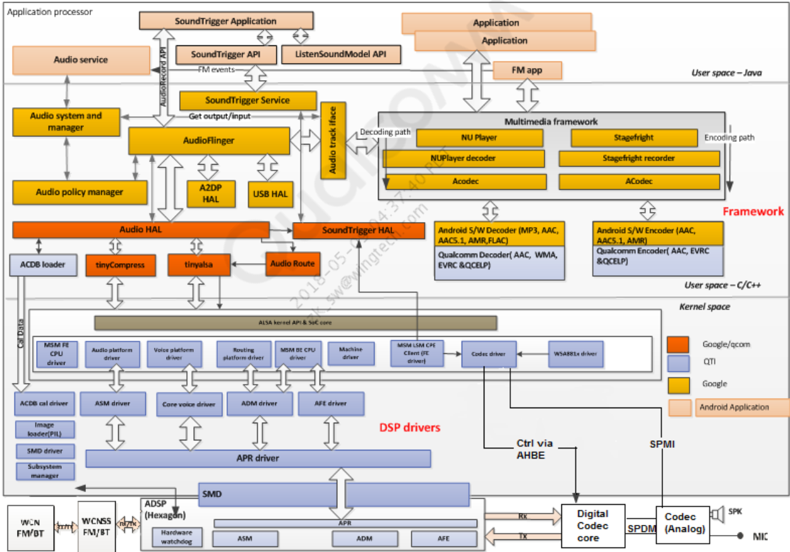
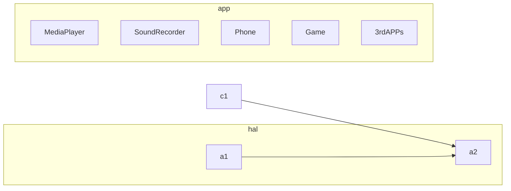

# 基础知识

# audio框架

层|功能
---|---
java|MediaPlayer audiorecord MediaRecorder AudioService AudioEffect MediaCodec
native|MediaPlayer MediaRecorder AudioSystem
native|AudioTrack AudioRecord AudioSystem AudioEffect AudioMixer AudioResampler

# app

- [Android 录音实现--MediaRecorder](./soundrecorder.md)
- [Android 播放音乐实现--MediaPlayer](./soundplayer.md)

# framework

## audio编解码(MediaCodec)

* [Android录音，PCM音频数据打包成AAC](https://blog.csdn.net/lavender1626/article/details/80394253?ops_request_misc=%257B%2522request%255Fid%2522%253A%2522158367717819725247656907%2522%252C%2522scm%2522%253A%252220140713.130056874..%2522%257D&request_id=158367717819725247656907&biz_id=0&utm_source=distribute.pc_search_result.none-task)
* [Android MediaCodec解码AAC，AudioTrack播放PCM音频](https://blog.csdn.net/lavender1626/article/details/80431902?ops_request_misc=%257B%2522request%255Fid%2522%253A%2522158367717819725247656907%2522%252C%2522scm%2522%253A%252220140713.130056874..%2522%257D&request_id=158367717819725247656907&biz_id=0&utm_source=distribute.pc_search_result.none-task)

## audiopolicy

- [Android audio 输出设备选择过程分析(上)](https://blog.csdn.net/bberdong/article/details/80484568?ops_request_misc=%257B%2522request%255Fid%2522%253A%2522159178455119725222457699%2522%252C%2522scm%2522%253A%252220140713.130102334..%2522%257D&request_id=159178455119725222457699&biz_id=0&utm_medium=distribute.pc_search_result.none-task-blog-2~all~first_rank_ecpm_v3~pc_rank_v3-1-80484568.first_rank_ecpm_v3_pc_rank_v3&utm_term=audio+%E8%AE%BE%E5%A4%87%E9%80%89%E6%8B%A9)
- [Android audio 输出设备选择过程分析(下)](https://blog.csdn.net/bberdong/article/details/81210600?ops_request_misc=%257B%2522request%255Fid%2522%253A%2522159178455119725247664650%2522%252C%2522scm%2522%253A%252220140713.130102334.pc%255Fall.%2522%257D&request_id=159178455119725247664650&biz_id=0&utm_medium=distribute.pc_search_result.none-task-blog-2~all~first_rank_ecpm_v3~pc_rank_v3-3-81210600.first_rank_ecpm_v3_pc_rank_v3&utm_term=audio+%E8%AE%BE%E5%A4%87%E9%80%89%E6%8B%A9)

## audiofliner

设备使用流程。adev_open_output_stream()  open_output_stream()使用

## AudioEffect
* [什么是AudioEffect](https://blog.csdn.net/Qidi_Huang/article/details/53741788?ops_request_misc=%257B%2522request%255Fid%2522%253A%2522158367735419725247664573%2522%252C%2522scm%2522%253A%252220140713.130056874..%2522%257D&request_id=158367735419725247664573&biz_id=0&utm_source=distribute.pc_search_result.none-task)
* [[Android] AudioEffect架构：从上层调用到底层音效驱动](https://blog.csdn.net/Joymine/article/details/75317016?depth_1-utm_source=distribute.pc_relevant.none-task&utm_source=distribute.pc_relevant.none-task)

## AudioMixer

AudioMixer是Android的混音器，通过混音器可以把各个音轨的音频数据混合在一起，然后输出到音频设备。
主要作用有重采样、改变音量大小、

* [【Android多媒体（重采样与混频）】重采样等基本概念](https://blog.csdn.net/Joymine/article/details/74530111?depth_1-utm_source=distribute.pc_relevant.none-task&utm_source=distribute.pc_relevant.none-task)
* [【Android多媒体（重采样与混频）】从playback流程分析AudioResampler，AudioMixer](https://blog.csdn.net/Joymine/article/details/74932552?ops_request_misc=%257B%2522request%255Fid%2522%253A%2522158367752819195162556952%2522%252C%2522scm%2522%253A%252220140713.130056874..%2522%257D&request_id=158367752819195162556952&biz_id=0&utm_source=distribute.pc_search_result.none-task)
* [【Android多媒体（重采样与混频）】从录音流程分析AudioResampler](https://blog.csdn.net/Joymine/article/details/74530302?depth_1-utm_source=distribute.pc_relevant.none-task&utm_source=distribute.pc_relevant.none-task)
* [android audio 音量设置分析](https://blog.csdn.net/WAN8180192/article/details/50705882?depth_1-utm_source=distribute.pc_relevant_right.none-task&utm_source=distribute.pc_relevant_right.none-task)
* [audio的输出设备切换分析](https://blog.csdn.net/WAN8180192/article/details/50705910?ops_request_misc=%257B%2522request%255Fid%2522%253A%2522158367804219724845011571%2522%252C%2522scm%2522%253A%252220140713.130056874..%2522%257D&request_id=158367804219724845011571&biz_id=0&utm_source=distribute.pc_search_result.none-task)
* [Android audio 输出设备选择过程分析(上)](https://blog.csdn.net/bberdong/article/details/80484568?depth_1-utm_source=distribute.pc_relevant_right.none-task&utm_source=distribute.pc_relevant_right.none-task)

## MediaPlayer/AudioTrack
* [【转】MediaPlayer 和 AudioTrack 的区别与联系](https://blog.csdn.net/Qidi_Huang/article/details/52633751?ops_request_misc=%257B%2522request%255Fid%2522%253A%2522158368061119724847013086%2522%252C%2522scm%2522%253A%252220140713.130056874..%2522%257D&request_id=158368061119724847013086&biz_id=0&utm_source=distribute.pc_search_result.none-task)
* [Android播放声音SoundPool、MediaPlayer、AudioTrack](https://blog.csdn.net/jwzhangjie/article/details/8843772?depth_1-utm_source=distribute.pc_relevant.none-task&utm_source=distribute.pc_relevant.none-task)

## MediaRecorder和AudioRecord
* [Android Multimedia实战（六）音频 MediaRecorder和AudioRecord录音与MediaPlayer和AudioTrack播放](https://blog.csdn.net/King1425/article/details/70915138?depth_1-utm_source=distribute.pc_relevant.none-task&utm_source=distribute.pc_relevant.none-task)

# hidl

hardware/interfaces/audio

# hal

- [remote_submix实现](./audio_remote_submix.md)
- [蓝牙耳机hal层实现](./audio_a2dp_hw.md)
- [usb声卡hal层实现]()
- hal

# kernel

- 耳机(三段、四段、欧标、美标)
- pa
- codec
- DAPM、Widget、KControl、Codec Driver、platform Driver、Machine Driver、DAI、DAI_LINK、DPCM

# 其他

* [android 录制系统内置声音：Android REMOTE_SUBMIX原理](https://blog.csdn.net/u010164190/article/details/103051369/)
* [Android 拨号音之 DTMF](https://blog.csdn.net/ch853199769/article/details/79901786?depth_1-utm_source=distribute.pc_relevant_right.none-task&utm_source=distribute.pc_relevant_right.none-task)

# 工具集

- **tinyalsa** -  tinymix,tinycap,tinyplay工具用于通路配置调试
- **mm-audio-ftm** - 高通工模，用于通路调试
- **Adboe Audition** - 分析音频文件波形
- **ffmpeg/ffplay** - 进行音频处理，及播放音频文件
- **QCAT** - 把modem log解析出音频文件，然后分析音频文件是否正常
- **QXDM** - 抓取modem log工具
- **diag_mdlog** - 命令行工具抓取modem log
- **QACT** - 高通acdb调试工具，主要调试高通音效处理算法
