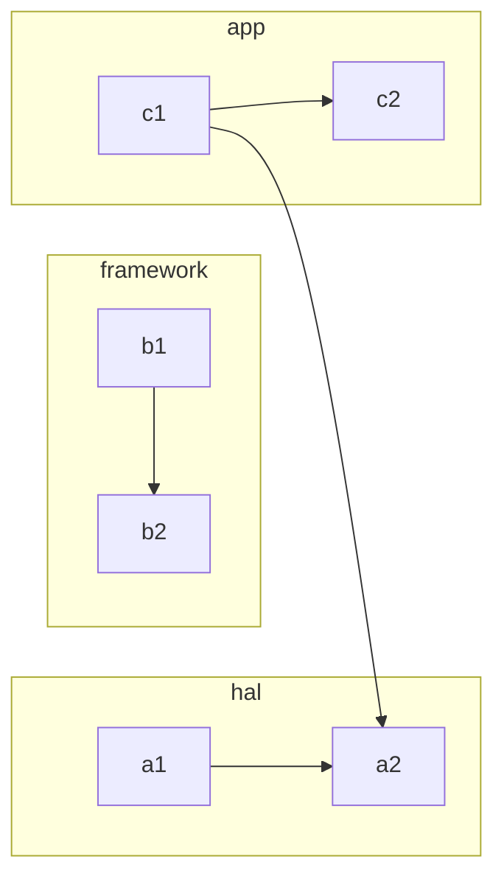
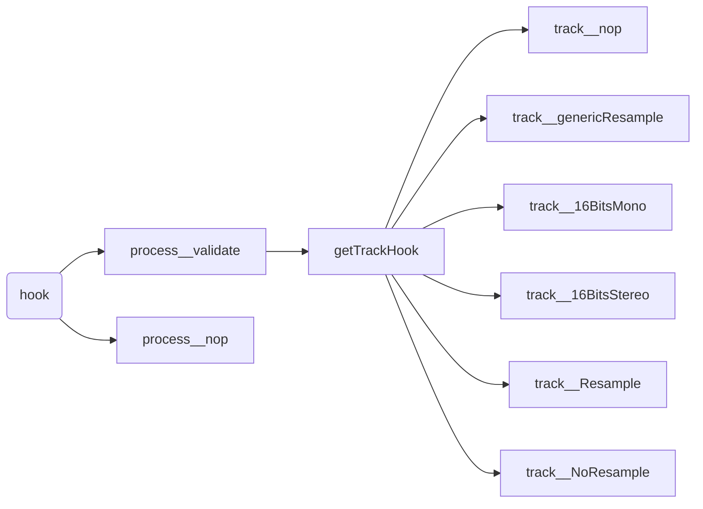

# 地方

> 每一个MixerThread都有一个唯一对应的AudioMixer(在MixerThread中用mAudioMixer表示)，它的作用如其名所表示的，就是为了完成音频的混音操作。
>
> MixerThread对外开放的接口主要涉及到Parameter(比如setParameter)、Resampler(比如setResampler)、Volume(比如adjustVolumeRamp)、Buffer(比如setBufferProvider)及Track(比如getTrackName)五个部分。

# 

```c++
AudioMixer()
create()
exists()
destroy()    
enable()
disable()
setParameter()
setBufferProvider()
process()
```




# 流程



```c++
void AudioMixer::process__validate()
{
    // TODO: fix all16BitsStereNoResample logic to
    // either properly handle muted tracks (it should ignore them)
    // or remove altogether as an obsolete optimization.
    bool all16BitsStereoNoResample = true;
    bool resampling = false;
    bool volumeRamp = false;

    mEnabled.clear();
    mGroups.clear();
    for (const auto &pair : mTracks) {
        const int name = pair.first;
        const std::shared_ptr<Track> &t = pair.second;
        if (!t->enabled) continue;

        mEnabled.emplace_back(name);  // we add to mEnabled in order of name.
        mGroups[t->mainBuffer].emplace_back(name); // mGroups also in order of name.

        uint32_t n = 0;
        // FIXME can overflow (mask is only 3 bits)
        n |= NEEDS_CHANNEL_1 + t->channelCount - 1;
        if (t->doesResample()) {//判断是否需要重采样，并改变掩码
            n |= NEEDS_RESAMPLE;
        }
        if (t->auxLevel != 0 && t->auxBuffer != NULL) {//判断是否为AUX设备数据，并改变掩码
            n |= NEEDS_AUX;
        }

        if (t->volumeInc[0]|t->volumeInc[1]) { //判断是否需要音量重采样。
            volumeRamp = true;
        } else if (!t->doesResample() && t->volumeRL == 0) {//不需要重采样&&音量为0，判断是静音；设置为静音掩码
            n |= NEEDS_MUTE;
        }
        t->needs = n;

        if (n & NEEDS_MUTE) {
            t->hook = &Track::track__nop;//静音模式，使用的track
        } else {
            if (n & NEEDS_AUX) {//立体音，不需要重采样
                all16BitsStereoNoResample = false;
            }
            if (n & NEEDS_RESAMPLE) {//需要重采样为单声道
                all16BitsStereoNoResample = false;
                resampling = true;
                t->hook = Track::getTrackHook(TRACKTYPE_RESAMPLE, t->mMixerChannelCount,
                        t->mMixerInFormat, t->mMixerFormat);
                ALOGV_IF((n & NEEDS_CHANNEL_COUNT__MASK) > NEEDS_CHANNEL_2,
                        "Track %d needs downmix + resample", name);
            } else {//单声道/双声道不需要重采样。 
                if ((n & NEEDS_CHANNEL_COUNT__MASK) == NEEDS_CHANNEL_1){//单声道
                    t->hook = Track::getTrackHook(
                            (t->mMixerChannelMask == AUDIO_CHANNEL_OUT_STEREO  // TODO: MONO_HACK
                                    && t->channelMask == AUDIO_CHANNEL_OUT_MONO)
                                ? TRACKTYPE_NORESAMPLEMONO : TRACKTYPE_NORESAMPLE,
                            t->mMixerChannelCount,
                            t->mMixerInFormat, t->mMixerFormat);
                    all16BitsStereoNoResample = false;
                }
                if ((n & NEEDS_CHANNEL_COUNT__MASK) >= NEEDS_CHANNEL_2){
                    t->hook = Track::getTrackHook(TRACKTYPE_NORESAMPLE, t->mMixerChannelCount,
                            t->mMixerInFormat, t->mMixerFormat);
                    ALOGV_IF((n & NEEDS_CHANNEL_COUNT__MASK) > NEEDS_CHANNEL_2,
                            "Track %d needs downmix", name);
                }
            }
        }
    }

    // select the processing hooks
    mHook = &AudioMixer::process__nop;
    if (mEnabled.size() > 0) {
        if (resampling) {
            if (mOutputTemp.get() == nullptr) {
                mOutputTemp.reset(new int32_t[MAX_NUM_CHANNELS * mFrameCount]);
            }
            if (mResampleTemp.get() == nullptr) {
                mResampleTemp.reset(new int32_t[MAX_NUM_CHANNELS * mFrameCount]);
            }
            mHook = &AudioMixer::process__genericResampling;
        } else {
            // we keep temp arrays around.
            mHook = &AudioMixer::process__genericNoResampling;
            if (all16BitsStereoNoResample && !volumeRamp) {
                if (mEnabled.size() == 1) {
                    const std::shared_ptr<Track> &t = mTracks[mEnabled[0]];
                    if ((t->needs & NEEDS_MUTE) == 0) {
                        // The check prevents a muted track from acquiring a process hook.
                        //
                        // This is dangerous if the track is MONO as that requires
                        // special case handling due to implicit channel duplication.
                        // Stereo or Multichannel should actually be fine here.
                        mHook = getProcessHook(PROCESSTYPE_NORESAMPLEONETRACK,
                                t->mMixerChannelCount, t->mMixerInFormat, t->mMixerFormat);
                    }
                }
            }
        }
    }

    ALOGV("mixer configuration change: %zu "
        "all16BitsStereoNoResample=%d, resampling=%d, volumeRamp=%d",
        mEnabled.size(), all16BitsStereoNoResample, resampling, volumeRamp);

   process();

    // Now that the volume ramp has been done, set optimal state and
    // track hooks for subsequent mixer process
    if (mEnabled.size() > 0) {
        bool allMuted = true;

        for (const int name : mEnabled) {
            const std::shared_ptr<Track> &t = mTracks[name];
            if (!t->doesResample() && t->volumeRL == 0) {
                t->needs |= NEEDS_MUTE;
                t->hook = &Track::track__nop;
            } else {
                allMuted = false;
            }
        }
        if (allMuted) {
            mHook = &AudioMixer::process__nop;
        } else if (all16BitsStereoNoResample) {
            if (mEnabled.size() == 1) {
                //const int i = 31 - __builtin_clz(enabledTracks);
                const std::shared_ptr<Track> &t = mTracks[mEnabled[0]];
                // Muted single tracks handled by allMuted above.
                mHook = getProcessHook(PROCESSTYPE_NORESAMPLEONETRACK,
                        t->mMixerChannelCount, t->mMixerInFormat, t->mMixerFormat);
            }
        }
    }
}
```

```c++
track__nop() //静音
track__genericResample() //重采样，修改音量
track__16BitsMono() //
track__16BitsStereo
track__Resample
track__NoResample
process__nop
```

