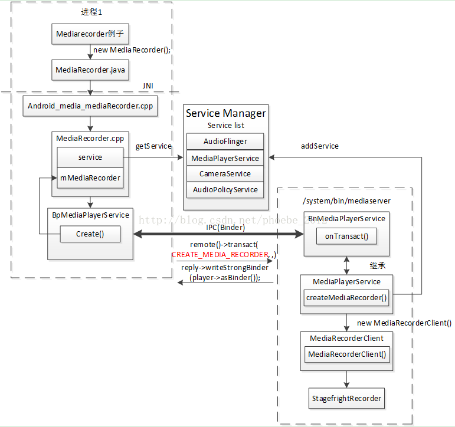

[toc]

# 前言

> Android系统在实现录音以及录像的功能均是通过使用MediaRecorder实现的。本篇文章主要介绍如何借助MediaRecorder实现**后台录音**功能。本章节内容主要参考android源码**packages/apps/SoundRecorder**

## audiosource的来源设置

|             来源             | 描述                                                         |
| :--------------------------: | ------------------------------------------------------------ |
|          CAMCORDER           | 录音来源于同方向的相机麦克风相同，若相机无内置相机或无法识别，则使用预设的麦克风 |
|           DEFAULT            | 默认音频源                                                   |
|             MIC              | 录音来源为主麦克风                                           |
|        REMOTE_SUBMIX         | 用于远程呈现的音频流的子混音的音频源，需要Manifest.permission.CAPTURE_AUDIO_OUTPUT权限，第三方应用无法申请 |
|         UNPROCESSED          | 与默认相同                                                   |
|          VOICE_CALL          | 记录上行与下行音频源，需要Manifest.permission.CAPTURE_AUDIO_OUTPUT权限，第三方应用无法申请 |
|     VOICE_COMMUNICATION      | 麦克风音频源针对VoIP等语音通信进行了调整,可以接收到通话的双方语音 |
| VOICE_DOWNLINK、VOICE_UPLINK | 上行下行的语音，需要Manifest.permission.CAPTURE_AUDIO_OUTPUT权限，第三方应用无法申请 |
|      VOICE_PERFORMANCE       | 捕获音频的来源意味着要实时处理并播放以进行现场演出           |
|      VOICE_RECOGNITION       | 用于获取语音进行语音识别                                     |

## 编码格式

| 音频编码 | 编码详解 |
| -------- | -------- |
| DEFAULT  |          |
| AMR_NB   |          |
| AMR_WB   |          |
| AAC      |          |
| HE_AAC   |          |
| AAC_ELD  |          |
| VORBIS   |          |
| OPUS     |          |
| EVRC     |          |
| QCELP    |          |
| LPCM     |          |
| MPEGH    |          |

## 输出格式

| 音频格式         | 音频格式详解                                                 |
| ---------------- | ------------------------------------------------------------ |
| DEFAULT          |                                                              |
| THREE_GPP        |                                                              |
| MPEG_4           |                                                              |
| AUDIO_ONLY_START | 以下为音频格式                                               |
| RAW_AMR          | 音频格式                                                     |
| AMR_NB           | 音频格式                                                     |
| AMR_WB           | 音频格式                                                     |
| AAC_ADIF         | 音频格式                                                     |
| AAC_ADTS         | 音频格式                                                     |
| AUDIO_ONLY_END   | 以下为视频格式                                               |
| RTP_AVP          |                                                              |
| MPEG2TS          | 编码方式H.264/AAC                                            |
| WEBM             | [WebM](https://baike.baidu.com/item/WebM/2455966?fr=aladdin)是Google开放免费的媒体文件格式。编码方式为VP8、Ogg Vorbis。 |
| HEIF             | 编码方式HEIC                                                 |
| OGG              |                                                              |
| QCP              |                                                              |
| WAVE             | [WAVE](https://baike.baidu.com/item/WAVE/13872619)是录音时用的标准的windows文件格式。 |

## 开始录制

```java
mRecorder = new MediaRecorder(); //
mRecorder.setAudioSource(MediaRecorder.AudioSource.MIC); //设置音频记录的音频源
mRecorder.setOutputFormat(outputfileformat); //设置记录的媒体文件的输出转换格式
mRecorder.setAudioEncoder(MediaRecorder.AudioEncoder.AMR_NB); //设置音频记录的编码方式
mRecorder.setOutputFile(mSampleFile.getAbsolutePath()); //媒体文件输出路径
mRecorder.prepare(); //准备录制 _setOutputFile() _prepare()
mRecorder.start(); //开始录制
```

```c++
android_media_MediaRecorder_native_setup()
android_media_MediaRecorder_setAudioSource()
android_media_MediaRecorder_setOutputFormat()
android_media_MediaRecorder_setAudioEncoder()
android_media_MediaRecorder_setOutputFileFD()
android_media_MediaRecorder_prepare()
android_media_MediaRecorder_start()
```

### android_media_MediaRecorder_native_setup

```
MediaRecorder.cpp -> IMediaPlayerService.cpp -> MediaPlayerService.cpp -> MediaRecorderClient.cpp -> StagefrightRecorder.cpp
MediaRecorder() -> createMediaRecorder() -> transact(CREATE_MEDIA_RECORDER, data, &reply); <-> IMediaPlayerService.createMediaRecorder -> MediaRecorderClient ->createStagefrightRecorder() ->StagefrightRecorder(opPackageName)
```




### android_media_MediaRecorder_setAudioSource

```
android_media_MediaRecorder.cpp -> mediarecorder.cpp -> IMediaRecorder.cpp ->MediaRecorderClient.cpp -> StagefrightRecorder.cpp
setAudioSource() -> transact(SET_AUDIO_SOURCE, data, &reply) <-> onTransact() ->setAudioSource() -> setAudioSource()
```

### android_media_MediaRecorder_setOutputFormat

```c++
android_media_MediaRecorder.cpp -> MediaRecorder.cpp -> IMediaRecorder.cpp -> MediaRecorderClient.cpp -> StagefrightRecorder.cpp
    setOutputFormat() -> setOutputFormat()-> transact(SET_OUTPUT_FORMAT, data, &reply) <-> onTransact() ->setOutputFormat() -> setOutputFormat()
```

### android_media_MediaRecorder_setAudioEncoder

```c++
android_media_MediaRecorder.cpp -> MediaRecorder.cpp -> IMediaRecorder.cpp -> MediaRecorderClient.cpp -> StagefrightRecorder.cpp
android_media_MediaRecorder_setAudioEncoder() -> setAudioEncoder()-> transact(SET_AUDIO_ENCODER, data, &reply) <-> onTransact() -> setAudioEncoder() -> setAudioEncoder()
```

### android_media_MediaRecorder_setOutputFileFD

```c++
MediaRecorder.java -> android_media_MediaRecorder.cpp -> MediaRecorder.cpp -> IMediaRecorder.cpp -> MediaRecorderClient.cpp -> StagefrightRecorder.cpp
prepare()-> _setOutputFile() -> android_media_MediaRecorder_setOutputFileFD() -> setOutputFile() -> transact(SET_OUTPUT_FILE_FD, data, &reply) <-> onTransact() -> setOutputFile() -> setOutputFile()
```

### android_media_MediaRecorder_prepare

```c++
MediaRecorder.java -> android_media_MediaRecorder.cpp -> MediaRecorder.cpp -> IMediaRecorder.cpp -> MediaRecorderClient.cpp -> StagefrightRecorder.cpp -> AMRWriter.cpp
prepare() -> _prepare() -> android_media_MediaRecorder_prepare() ->prepare()-> transact(PREPARE, data, &reply) <-> onTransact() -> prepare() -> prepare() -> prepareInternal() ->setupAMRRecording() -> AMRWriter() ->setupRawAudioRecording()
```

```
setupMPEG4orWEBMRecording() //录像录音
setupAMRRecording() //录音
setupAACRecording() //录音
setupRTPRecording() //录像录音
setupMPEG2TSRecording() //录像录音
setupOggRecording() //录音
```

```c++
status_t StagefrightRecorder::setupRawAudioRecording() {
    if (mAudioSource >= AUDIO_SOURCE_CNT && mAudioSource != AUDIO_SOURCE_FM_TUNER) {
        ALOGE("Invalid audio source: %d", mAudioSource);
        return BAD_VALUE;
    }

    status_t status = BAD_VALUE;
    //检查比特率、采样率、通道数是否有效
    if (OK != (status = checkAudioEncoderCapabilities())) {
        return status;
    }
	//设置音频源和设置音频编码器
    //会创建AudioSource()对象和创建MediaCodecSource()对象
    sp<MediaCodecSource> audioEncoder = createAudioSource();
    if (audioEncoder != NULL) {
        CHECK(mWriter != 0);
        mWriter->addSource(audioEncoder);
        mAudioEncoderSource = audioEncoder;
    } else if (audioEncoder == NULL && mAudioEncoder == AUDIO_ENCODER_LPCM) {
        CHECK(mWriter != 0);
        sp<MediaSource> src = setPCMRecording();//录制pcm格式音频，目前没找到该函数原型
        if (src == NULL) {
            ALOGE("Recording source is null");
            return UNKNOWN_ERROR;
        }
        mAudioSourceNode =  reinterpret_cast<AudioSource* > (src.get());
        mWriter->addSource(src);
    } else if (audioEncoder == NULL) {
        return UNKNOWN_ERROR;
    }


    if (mMaxFileDurationUs != 0) {
        mWriter->setMaxFileDuration(mMaxFileDurationUs);
    }
    if (mMaxFileSizeBytes != 0) {
        mWriter->setMaxFileSize(mMaxFileSizeBytes);
    }
    mWriter->setListener(mListener);

    return OK;
}
```

### android_media_MediaRecorder_start()

```c++
android_media_MediaRecorder.cpp -> MediaRecorder.cpp -> IMediaRecorder.cpp -> MediaRecorderClient.cpp -> StagefrightRecorder.cpp -> AMRWriter.cpp -> MediaSource
android_media_MediaRecorder_start() -> start() -> transact(START, data, &reply) <-> onTransact() -> start() -> start()->start()->start()
```

```c++
status_t StagefrightRecorder::start() {
    ALOGV("start");
    Mutex::Autolock autolock(mLock);
    if (mOutputFd < 0) {
        ALOGE("Output file descriptor is invalid");
        return INVALID_OPERATION;
    }

    status_t status = OK;

    if (mVideoSource != VIDEO_SOURCE_SURFACE) { //录音选择的方式OUTPUT_FORMAT_AMR_NB
        status = prepareInternal();//调用setupAMRRecording(),重点分析
        if (status != OK) {
            return status;
        }
    }

    if (mWriter == NULL) {
        ALOGE("File writer is not avaialble");
        return UNKNOWN_ERROR;
    }

    switch (mOutputFormat) {
        case OUTPUT_FORMAT_DEFAULT:
        case OUTPUT_FORMAT_THREE_GPP:
        case OUTPUT_FORMAT_MPEG_4:
        case OUTPUT_FORMAT_WEBM:
        {
            bool isMPEG4 = true;
            if (mOutputFormat == OUTPUT_FORMAT_WEBM) {
                isMPEG4 = false;
            }
            sp<MetaData> meta = new MetaData;
            setupMPEG4orWEBMMetaData(&meta);
            status = mWriter->start(meta.get());
            break;
        }

        case OUTPUT_FORMAT_AMR_NB:
        case OUTPUT_FORMAT_AMR_WB:
        case OUTPUT_FORMAT_AAC_ADIF:
        case OUTPUT_FORMAT_AAC_ADTS:
        case OUTPUT_FORMAT_RTP_AVP:
        case OUTPUT_FORMAT_MPEG2TS:
        case OUTPUT_FORMAT_OGG:
        {
            sp<MetaData> meta = new MetaData;
            int64_t startTimeUs = systemTime() / 1000;
            meta->setInt64(kKeyTime, startTimeUs);
            status = mWriter->start(meta.get()); //重点分析
            break;
        }

        default:
        {
            if (handleCustomOutputFormats() != OK) {
                ALOGE("Unsupported output file format: %d", mOutputFormat);
                status = UNKNOWN_ERROR;
            }
            break;
        }
    }

    if (status != OK) {
        mWriter.clear();
        mWriter = NULL;
    }

    if ((status == OK) && (!mStarted)) {
        mAnalyticsDirty = true;
        mStarted = true;

        mStartedRecordingUs = systemTime() / 1000;

        uint32_t params = IMediaPlayerService::kBatteryDataCodecStarted;
        if (mAudioSource != AUDIO_SOURCE_CNT) {
            params |= IMediaPlayerService::kBatteryDataTrackAudio;
        }
        if (mVideoSource != VIDEO_SOURCE_LIST_END) {
            params |= IMediaPlayerService::kBatteryDataTrackVideo;
        }

        addBatteryData(params);
    }

    return status;
}
```

```c++
status_t StagefrightRecorder::setupAMRRecording() {
    CHECK(mOutputFormat == OUTPUT_FORMAT_AMR_NB ||
          mOutputFormat == OUTPUT_FORMAT_AMR_WB);

    if (mOutputFormat == OUTPUT_FORMAT_AMR_NB) {
        if (mAudioEncoder != AUDIO_ENCODER_DEFAULT &&
            mAudioEncoder != AUDIO_ENCODER_AMR_NB) {
            ALOGE("Invalid encoder %d used for AMRNB recording",
                    mAudioEncoder);
            return BAD_VALUE;
        }
    } else {  // mOutputFormat must be OUTPUT_FORMAT_AMR_WB
        if (mAudioEncoder != AUDIO_ENCODER_AMR_WB) {
            ALOGE("Invlaid encoder %d used for AMRWB recording",
                    mAudioEncoder);
            return BAD_VALUE;
        }
    }

    mWriter = new AMRWriter(mOutputFd);//AMRWriter.cpp
    return setupRawAudioRecording();//
}
```

```c++
status_t StagefrightRecorder::setupRawAudioRecording() {
    if (mAudioSource >= AUDIO_SOURCE_CNT && mAudioSource != AUDIO_SOURCE_FM_TUNER) {
        ALOGE("Invalid audio source: %d", mAudioSource);
        return BAD_VALUE;
    }

    status_t status = BAD_VALUE;
    //检查比特率、采样率、通道数是否有效
    if (OK != (status = checkAudioEncoderCapabilities())) {
        return status;
    }
	//设置音频源和设置音频编码器
    //会创建AudioSource()对象和创建MediaCodecSource()对象
    sp<MediaCodecSource> audioEncoder = createAudioSource();//
    if (audioEncoder != NULL) {
        CHECK(mWriter != 0);
        mWriter->addSource(audioEncoder);
        mAudioEncoderSource = audioEncoder;
    } else if (audioEncoder == NULL && mAudioEncoder == AUDIO_ENCODER_LPCM) {
        CHECK(mWriter != 0);
        sp<MediaSource> src = setPCMRecording();//录制pcm格式音频，目前没找到该函数原型
        if (src == NULL) {
            ALOGE("Recording source is null");
            return UNKNOWN_ERROR;
        }
        mAudioSourceNode =  reinterpret_cast<AudioSource* > (src.get());
        mWriter->addSource(src);
    } else if (audioEncoder == NULL) {
        return UNKNOWN_ERROR;
    }


    if (mMaxFileDurationUs != 0) {
        mWriter->setMaxFileDuration(mMaxFileDurationUs);
    }
    if (mMaxFileSizeBytes != 0) {
        mWriter->setMaxFileSize(mMaxFileSizeBytes);
    }
    mWriter->setListener(mListener);

    return OK;
}
```

```c++
sp<MediaCodecSource> StagefrightRecorder::createAudioSource() {
    int32_t sourceSampleRate = mSampleRate;

    if (mCaptureFpsEnable && mCaptureFps >= mFrameRate) {
        // Upscale the sample rate for slow motion recording.
        // Fail audio source creation if source sample rate is too high, as it could
        // cause out-of-memory due to large input buffer size. And audio recording
        // probably doesn't make sense in the scenario, since the slow-down factor
        // is probably huge (eg. mSampleRate=48K, mCaptureFps=240, mFrameRate=1).
        const static int32_t SAMPLE_RATE_HZ_MAX = 192000;
        sourceSampleRate =
                (mSampleRate * mCaptureFps + mFrameRate / 2) / mFrameRate;
        if (sourceSampleRate < mSampleRate || sourceSampleRate > SAMPLE_RATE_HZ_MAX) {
            ALOGE("source sample rate out of range! "
                    "(mSampleRate %d, mCaptureFps %.2f, mFrameRate %d",
                    mSampleRate, mCaptureFps, mFrameRate);
            return NULL;
        }
    }

    //重点：AVFactory::createAudioSource() -> AudioSource() -> AudioRecord()
    // -> set()
    sp<AudioSource> audioSource = AVFactory::get()->createAudioSource(
                mAudioSource,
                mOpPackageName,
                sourceSampleRate,
                mAudioChannels,
                mSampleRate,
                mClientUid,
                mClientPid,
                mSelectedDeviceId,
                mSelectedMicDirection,
                mSelectedMicFieldDimension);

    status_t err = audioSource->initCheck();

    if (err != OK) {
        ALOGE("audio source is not initialized");
        return NULL;
    }

    sp<AMessage> format = new AMessage;
    switch (mAudioEncoder) {
        case AUDIO_ENCODER_AMR_NB:
        case AUDIO_ENCODER_DEFAULT:
            format->setString("mime", MEDIA_MIMETYPE_AUDIO_AMR_NB);
            break;
        case AUDIO_ENCODER_AMR_WB:
            format->setString("mime", MEDIA_MIMETYPE_AUDIO_AMR_WB);
            break;
        case AUDIO_ENCODER_AAC:
            format->setString("mime", MEDIA_MIMETYPE_AUDIO_AAC);
            format->setInt32("aac-profile", OMX_AUDIO_AACObjectLC);
            break;
        case AUDIO_ENCODER_HE_AAC:
            format->setString("mime", MEDIA_MIMETYPE_AUDIO_AAC);
            format->setInt32("aac-profile", OMX_AUDIO_AACObjectHE);
            break;
        case AUDIO_ENCODER_AAC_ELD:
            format->setString("mime", MEDIA_MIMETYPE_AUDIO_AAC);
            format->setInt32("aac-profile", OMX_AUDIO_AACObjectELD);
            break;
        case AUDIO_ENCODER_OPUS:
            format->setString("mime", MEDIA_MIMETYPE_AUDIO_OPUS);
            break;

        default:
            if (handleCustomAudioSource(format) != OK) {
                ALOGE("Unknown audio encoder: %d", mAudioEncoder);
                return NULL;
            }
    }

    // log audio mime type for media metrics
    if (mAnalyticsItem != NULL) {
        AString audiomime;
        if (format->findString("mime", &audiomime)) {
            mAnalyticsItem->setCString(kRecorderAudioMime, audiomime.c_str());
        }
    }

    int32_t maxInputSize;
    CHECK(audioSource->getFormat()->findInt32(
                kKeyMaxInputSize, &maxInputSize));

    format->setInt32("max-input-size", maxInputSize);
    format->setInt32("channel-count", mAudioChannels);
    format->setInt32("sample-rate", mSampleRate);
    format->setInt32("bitrate", mAudioBitRate);
    if (mAudioTimeScale > 0) {
        format->setInt32("time-scale", mAudioTimeScale);
    }
    format->setInt32("priority", 0 /* realtime */);

    //重点：编解码服务创建MediaCodecSource.cpp
    sp<MediaCodecSource> audioEncoder =
            MediaCodecSource::Create(mLooper, format, audioSource);
    if (audioEncoder == NULL) {
        ALOGE("Failed to create audio encoder");
    } else {
        sp<AudioSystem::AudioDeviceCallback> callback = mAudioDeviceCallback.promote();
    if (mDeviceCallbackEnabled && callback != 0) {
        audioSource->addAudioDeviceCallback(callback);
    }
    mAudioSourceNode = audioSource;

    }

    return audioEncoder;
}
```

```c++
status_t AudioRecord::set(
        audio_source_t inputSource,
        uint32_t sampleRate,
        audio_format_t format,
        audio_channel_mask_t channelMask,
        size_t frameCount,
        callback_t cbf,
        void* user,
        uint32_t notificationFrames,
        bool threadCanCallJava,
        audio_session_t sessionId,
        transfer_type transferType,
        audio_input_flags_t flags,
        uid_t uid,
        pid_t pid,
        const audio_attributes_t* pAttributes,
        audio_port_handle_t selectedDeviceId,
        audio_microphone_direction_t selectedMicDirection,
        float microphoneFieldDimension)
{
    status_t status = NO_ERROR;
    uint32_t channelCount;
    pid_t callingPid;
    pid_t myPid;

    // Note mPortId is not valid until the track is created, so omit mPortId in ALOG for set.
    ALOGV("%s(): inputSource %d, sampleRate %u, format %#x, channelMask %#x, frameCount %zu, "
          "notificationFrames %u, sessionId %d, transferType %d, flags %#x, opPackageName %s "
          "uid %d, pid %d",
          __func__,
          inputSource, sampleRate, format, channelMask, frameCount, notificationFrames,
          sessionId, transferType, flags, String8(mOpPackageName).string(), uid, pid);

    mTracker.reset(new RecordingActivityTracker());

    mSelectedDeviceId = selectedDeviceId;
    mSelectedMicDirection = selectedMicDirection;
    mSelectedMicFieldDimension = microphoneFieldDimension;

    switch (transferType) {
    case TRANSFER_DEFAULT:
        if (cbf == NULL || threadCanCallJava) {
            transferType = TRANSFER_SYNC;
        } else {
            transferType = TRANSFER_CALLBACK;
        }
        break;
    case TRANSFER_CALLBACK:
        if (cbf == NULL) {
            ALOGE("%s(): Transfer type TRANSFER_CALLBACK but cbf == NULL", __func__);
            status = BAD_VALUE;
            goto exit;
        }
        break;
    case TRANSFER_OBTAIN:
    case TRANSFER_SYNC:
        break;
    default:
        ALOGE("%s(): Invalid transfer type %d", __func__, transferType);
        status = BAD_VALUE;
        goto exit;
    }
    mTransfer = transferType;

    // invariant that mAudioRecord != 0 is true only after set() returns successfully
    if (mAudioRecord != 0) {
        ALOGE("%s(): Track already in use", __func__);
        status = INVALID_OPERATION;
        goto exit;
    }

    if (pAttributes == NULL) {
        memset(&mAttributes, 0, sizeof(audio_attributes_t));
        mAttributes.source = inputSource;
    } else {
        // stream type shouldn't be looked at, this track has audio attributes
        memcpy(&mAttributes, pAttributes, sizeof(audio_attributes_t));
        ALOGV("%s(): Building AudioRecord with attributes: source=%d flags=0x%x tags=[%s]",
                __func__, mAttributes.source, mAttributes.flags, mAttributes.tags);
    }

    mSampleRate = sampleRate;//录音采样率

    // these below should probably come from the audioFlinger too...
    if (format == AUDIO_FORMAT_DEFAULT) {
        format = AUDIO_FORMAT_PCM_16_BIT;
    }

    // validate parameters
    // AudioFlinger capture only supports linear PCM
    if (!audio_is_valid_format(format) || !audio_is_linear_pcm(format)) {
        ALOGE("%s(): Format %#x is not linear pcm", __func__, format);
        status = BAD_VALUE;
        goto exit;
    }
    mFormat = format;//编码格式

    if (!audio_is_input_channel(channelMask)) {
        ALOGE("%s(): Invalid channel mask %#x", __func__, channelMask);
        status = BAD_VALUE;
        goto exit;
    }
    mChannelMask = channelMask;
    channelCount = audio_channel_count_from_in_mask(channelMask);//音频通道
    mChannelCount = channelCount;

    if (audio_is_linear_pcm(format)) {
        mFrameSize = channelCount * audio_bytes_per_sample(format);
    } else {
        mFrameSize = sizeof(uint8_t);
    }

    // mFrameCount is initialized in createRecord_l
    mReqFrameCount = frameCount;

    mNotificationFramesReq = notificationFrames;
    // mNotificationFramesAct is initialized in createRecord_l

    mSessionId = sessionId;//不知道啥含义
    ALOGV("%s(): mSessionId %d", __func__, mSessionId);

    callingPid = IPCThreadState::self()->getCallingPid();//被某进程调用
    myPid = getpid();
    if (uid == AUDIO_UID_INVALID || (callingPid != myPid)) {
        mClientUid = IPCThreadState::self()->getCallingUid();
    } else {
        mClientUid = uid; //uid用于标识被哪个app调用。
    }
    if (pid == -1 || (callingPid != myPid)) {
        mClientPid = callingPid;
    } else {
        mClientPid = pid;
    }

    mOrigFlags = mFlags = flags;
    mCbf = cbf;

    if (cbf != NULL) {
        mAudioRecordThread = new AudioRecordThread(*this);//重点：创建录音线程。
        mAudioRecordThread->run("AudioRecord", ANDROID_PRIORITY_AUDIO);
        // thread begins in paused state, and will not reference us until start()
    }

    // create the IAudioRecord
    {
        AutoMutex lock(mLock);
        status = createRecord_l(0 /*epoch*/, mOpPackageName);
    }

    ALOGV("%s(%d): status %d", __func__, mPortId, status);

    if (status != NO_ERROR) {
        if (mAudioRecordThread != 0) {
            mAudioRecordThread->requestExit();   // see comment in AudioRecord.h
            mAudioRecordThread->requestExitAndWait();
            mAudioRecordThread.clear();
        }
        goto exit;
    }

    mUserData = user;
    // TODO: add audio hardware input latency here
    if (mTransfer == TRANSFER_CALLBACK ||
            mTransfer == TRANSFER_SYNC) {
        mLatency = (1000 * mNotificationFramesAct) / mSampleRate;
    } else {
        mLatency = (1000 * mFrameCount) / mSampleRate;
    }
    mMarkerPosition = 0;
    mMarkerReached = false;
    mNewPosition = 0;
    mUpdatePeriod = 0;
    AudioSystem::acquireAudioSessionId(mSessionId, -1);
    mSequence = 1;
    mObservedSequence = mSequence;
    mInOverrun = false;
    mFramesRead = 0;
    mFramesReadServerOffset = 0;

exit:
    mStatus = status;
    if (status != NO_ERROR) {
        mMediaMetrics.markError(status, __FUNCTION__);
    }
    return status;
}

```


```
status_t AMRWriter::start(MetaData * /* params */) {
    if (mInitCheck != OK) {
        return mInitCheck;
    }

    if (mSource == NULL) {
        return UNKNOWN_ERROR;
    }

    if (mStarted && mPaused) {
        mPaused = false;
        mResumed = true;
        return OK;
    } else if (mStarted) {
        // Already started, does nothing
        return OK;
    }

	//这是重点
    status_t err = mSource->start(); //AudioSource.cpp -> AudioSource::start() ->AudioRecord::start()

    if (err != OK) {
        return err;
    }

    pthread_attr_t attr;
    pthread_attr_init(&attr);
    pthread_attr_setdetachstate(&attr, PTHREAD_CREATE_JOINABLE);

    mReachedEOS = false;
    mDone = false;

    pthread_create(&mThread, &attr, ThreadWrapper, this);
    pthread_attr_destroy(&attr);

    mStarted = true;

    return OK;
}
```

```c++
status_t AudioRecord::start(AudioSystem::sync_event_t event, audio_session_t triggerSession)
{
    ALOGV("%s(%d): sync event %d trigger session %d", __func__, mPortId, event, triggerSession);
    SEEMPLOG_RECORD(71,"");

    AutoMutex lock(mLock);
    if (mActive) {
        return NO_ERROR;
    }

    // discard data in buffer
    const uint32_t framesFlushed = mProxy->flush();
    mFramesReadServerOffset -= mFramesRead + framesFlushed;
    mFramesRead = 0;
    mProxy->clearTimestamp();  // timestamp is invalid until next server push

    // reset current position as seen by client to 0
    mProxy->setEpoch(mProxy->getEpoch() - mProxy->getPosition());
    // force refresh of remaining frames by processAudioBuffer() as last
    // read before stop could be partial.
    mRefreshRemaining = true;

    mNewPosition = mProxy->getPosition() + mUpdatePeriod;
    int32_t flags = android_atomic_acquire_load(&mCblk->mFlags);

    // we reactivate markers (mMarkerPosition != 0) as the position is reset to 0.
    // This is legacy behavior.  This is not done in stop() to avoid a race condition
    // where the last marker event is issued twice.
    mMarkerReached = false;
    // mActive is checked by restoreRecord_l
    mActive = true;

    status_t status = NO_ERROR;
    if (!(flags & CBLK_INVALID)) {
        //重点： AudioRecord.cpp -> IAudioFlinger.cpp -> AudioFlinger.cpp -> Tracks.cpp
        // mAudioRecord <-> record = audioFlinger->createRecord() -> RecordHandle()
        //所以等于 mAudioRecord = RecordHandle
        
        status = mAudioRecord->start(event, triggerSession).transactionError();//-> RecordHandle::start()
        if (status == DEAD_OBJECT) {
            flags |= CBLK_INVALID;
        }
    }
    if (flags & CBLK_INVALID) {
        status = restoreRecord_l("start");
    }

    // Call these directly because we are already holding the lock.
    mAudioRecord->setPreferredMicrophoneDirection(mSelectedMicDirection);
    mAudioRecord->setPreferredMicrophoneFieldDimension(mSelectedMicFieldDimension);

    if (status != NO_ERROR) {
        mActive = false;
        ALOGE("%s(%d): status %d", __func__, mPortId, status);
        mMediaMetrics.markError(status, __FUNCTION__);
    } else {
        mTracker->recordingStarted();
        sp<AudioRecordThread> t = mAudioRecordThread;
        if (t != 0) {
            t->resume();
        } else {
            mPreviousPriority = getpriority(PRIO_PROCESS, 0);
            get_sched_policy(0, &mPreviousSchedulingGroup);
            androidSetThreadPriority(0, ANDROID_PRIORITY_AUDIO);
        }

        // we've successfully started, log that time
        mMediaMetrics.logStart(systemTime());
    }
    return status;
}
```


```c++
//Tracks.cpp
AudioFlinger::RecordHandle::RecordHandle(
        const sp<AudioFlinger::RecordThread::RecordTrack>& recordTrack)
    : BnAudioRecord(),
    mRecordTrack(recordTrack)//Tracks.cpp
{
}
```

```c++
status_t AudioFlinger::RecordThread::RecordTrack::start(AudioSystem::sync_event_t event,
                                                        audio_session_t triggerSession)//Tracks.cpp
{
    sp<ThreadBase> thread = mThread.promote();
    if (thread != 0) {
        RecordThread *recordThread = (RecordThread *)thread.get();
        return recordThread->start(this, event, triggerSession);//Threads.cpp -> AudioFlinger::RecordThread::start
    } else {
        return BAD_VALUE;
    }
}
```

```c++
AudioFlinger::RecordThread::RecordThread(const sp<AudioFlinger>& audioFlinger,
                                         AudioStreamIn *input,
                                         audio_io_handle_t id,
                                         audio_devices_t outDevice,
                                         audio_devices_t inDevice,
                                         bool systemReady
                                         ) :
    ThreadBase(audioFlinger, id, outDevice, inDevice, RECORD, systemReady),
    mInput(input),
    mActiveTracks(&this->mLocalLog),
    mRsmpInBuffer(NULL),
    // mRsmpInFrames, mRsmpInFramesP2, and mRsmpInFramesOA are set by readInputParameters_l()
    mRsmpInRear(0)
    , mReadOnlyHeap(new MemoryDealer(kRecordThreadReadOnlyHeapSize,
            "RecordThreadRO", MemoryHeapBase::READ_ONLY))
    // mFastCapture below
    , mFastCaptureFutex(0)
    // mInputSource
    // mPipeSink
    // mPipeSource
    , mPipeFramesP2(0)
    // mPipeMemory
    // mFastCaptureNBLogWriter
    , mFastTrackAvail(false)
    , mBtNrecSuspended(false)
{
    snprintf(mThreadName, kThreadNameLength, "AudioIn_%X", id);
    mNBLogWriter = audioFlinger->newWriter_l(kLogSize, mThreadName);

    if (mInput != nullptr && mInput->audioHwDev != nullptr) {
        mIsMsdDevice = strcmp(
                mInput->audioHwDev->moduleName(), AUDIO_HARDWARE_MODULE_ID_MSD) == 0;
    }

    readInputParameters_l();

    // TODO: We may also match on address as well as device type for
    // AUDIO_DEVICE_IN_BUS, AUDIO_DEVICE_IN_BLUETOOTH_A2DP, AUDIO_DEVICE_IN_REMOTE_SUBMIX
    mTimestampCorrectedDevices = (audio_devices_t)property_get_int64(
            "audio.timestamp.corrected_input_devices",
            (int64_t)(mIsMsdDevice ? AUDIO_DEVICE_IN_BUS // turn on by default for MSD
                                   : AUDIO_DEVICE_NONE));

    // create an NBAIO source for the HAL input stream, and negotiate
    mInputSource = new AudioStreamInSource(input->stream);
    size_t numCounterOffers = 0;
    const NBAIO_Format offers[1] = {Format_from_SR_C(mSampleRate, mChannelCount, mFormat)};
#if !LOG_NDEBUG
    ssize_t index =
#else
    (void)
#endif
            mInputSource->negotiate(offers, 1, NULL, numCounterOffers);
    ALOG_ASSERT(index == 0);

    // initialize fast capture depending on configuration
    bool initFastCapture;
    switch (kUseFastCapture) {
    case FastCapture_Never:
        initFastCapture = false;
        ALOGV("%p kUseFastCapture = Never, initFastCapture = false", this);
        break;
    case FastCapture_Always:
        initFastCapture = true;
        ALOGV("%p kUseFastCapture = Always, initFastCapture = true", this);
        break;
    case FastCapture_Static:
        initFastCapture = (mFrameCount * 1000) / mSampleRate < kMinNormalCaptureBufferSizeMs;
        ALOGV("%p kUseFastCapture = Static, (%lld * 1000) / %u vs %u, initFastCapture = %d",
                this, (long long)mFrameCount, mSampleRate, kMinNormalCaptureBufferSizeMs,
                initFastCapture);
        break;
    // case FastCapture_Dynamic:
    }

    if (initFastCapture) {
        // create a Pipe for FastCapture to write to, and for us and fast tracks to read from
        NBAIO_Format format = mInputSource->format();
        // quadruple-buffering of 20 ms each; this ensures we can sleep for 20ms in RecordThread
        size_t pipeFramesP2 = roundup(4 * FMS_20 * mSampleRate / 1000);
        size_t pipeSize = pipeFramesP2 * Format_frameSize(format);
        void *pipeBuffer = nullptr;
        const sp<MemoryDealer> roHeap(readOnlyHeap());
        sp<IMemory> pipeMemory;
        if ((roHeap == 0) ||
                (pipeMemory = roHeap->allocate(pipeSize)) == 0 ||
                (pipeBuffer = pipeMemory->pointer()) == nullptr) {
            ALOGE("not enough memory for pipe buffer size=%zu; "
                    "roHeap=%p, pipeMemory=%p, pipeBuffer=%p; roHeapSize: %lld",
                    pipeSize, roHeap.get(), pipeMemory.get(), pipeBuffer,
                    (long long)kRecordThreadReadOnlyHeapSize);
            goto failed;
        }
        // pipe will be shared directly with fast clients, so clear to avoid leaking old information
        memset(pipeBuffer, 0, pipeSize);
        Pipe *pipe = new Pipe(pipeFramesP2, format, pipeBuffer);
        const NBAIO_Format offers[1] = {format};
        size_t numCounterOffers = 0;
        ssize_t index = pipe->negotiate(offers, 1, NULL, numCounterOffers);
        ALOG_ASSERT(index == 0);
        mPipeSink = pipe;
        PipeReader *pipeReader = new PipeReader(*pipe);
        numCounterOffers = 0;
        index = pipeReader->negotiate(offers, 1, NULL, numCounterOffers);
        ALOG_ASSERT(index == 0);
        mPipeSource = pipeReader;
        mPipeFramesP2 = pipeFramesP2;
        mPipeMemory = pipeMemory;

        // create fast capture
        mFastCapture = new FastCapture();
        FastCaptureStateQueue *sq = mFastCapture->sq();
#ifdef STATE_QUEUE_DUMP
        // FIXME
#endif
        FastCaptureState *state = sq->begin();
        state->mCblk = NULL;
        state->mInputSource = mInputSource.get();
        state->mInputSourceGen++;
        state->mPipeSink = pipe;
        state->mPipeSinkGen++;
        state->mFrameCount = mFrameCount;
        state->mCommand = FastCaptureState::COLD_IDLE;
        // already done in constructor initialization list
        //mFastCaptureFutex = 0;
        state->mColdFutexAddr = &mFastCaptureFutex;
        state->mColdGen++;
        state->mDumpState = &mFastCaptureDumpState;
#ifdef TEE_SINK
        // FIXME
#endif
        mFastCaptureNBLogWriter = audioFlinger->newWriter_l(kFastCaptureLogSize, "FastCapture");
        state->mNBLogWriter = mFastCaptureNBLogWriter.get();
        sq->end();
        sq->push(FastCaptureStateQueue::BLOCK_UNTIL_PUSHED);

        // start the fast capture
        mFastCapture->run("FastCapture", ANDROID_PRIORITY_URGENT_AUDIO);
        pid_t tid = mFastCapture->getTid();
        sendPrioConfigEvent(getpid(), tid, kPriorityFastCapture, false /*forApp*/);
        stream()->setHalThreadPriority(kPriorityFastCapture);
#ifdef AUDIO_WATCHDOG
        // FIXME
#endif

        mFastTrackAvail = true;
    }
#ifdef TEE_SINK
    mTee.set(mInputSource->format(), NBAIO_Tee::TEE_FLAG_INPUT_THREAD);
    mTee.setId(std::string("_") + std::to_string(mId) + "_C");
#endif
failed: ;

    // FIXME mNormalSource
}
```

```c++
status_t AudioFlinger::RecordThread::start(RecordThread::RecordTrack* recordTrack,
                                           AudioSystem::sync_event_t event,
                                           audio_session_t triggerSession)
{
    ALOGV("RecordThread::start event %d, triggerSession %d", event, triggerSession);
    sp<ThreadBase> strongMe = this;
    status_t status = NO_ERROR;

    if (event == AudioSystem::SYNC_EVENT_NONE) {
        recordTrack->clearSyncStartEvent();
    } else if (event != AudioSystem::SYNC_EVENT_SAME) {
        recordTrack->mSyncStartEvent = mAudioFlinger->createSyncEvent(event,
                                       triggerSession,
                                       recordTrack->sessionId(),
                                       syncStartEventCallback,
                                       recordTrack);
        // Sync event can be cancelled by the trigger session if the track is not in a
        // compatible state in which case we start record immediately
        if (recordTrack->mSyncStartEvent->isCancelled()) {
            recordTrack->clearSyncStartEvent();
        } else {
            // do not wait for the event for more than AudioSystem::kSyncRecordStartTimeOutMs
            recordTrack->mFramesToDrop = -(ssize_t)
                    ((AudioSystem::kSyncRecordStartTimeOutMs * recordTrack->mSampleRate) / 1000);
        }
    }

    {
        // This section is a rendezvous between binder thread executing start() and RecordThread
        AutoMutex lock(mLock);
        if (recordTrack->isInvalid()) {
            recordTrack->clearSyncStartEvent();
            return INVALID_OPERATION;
        }
        if (mActiveTracks.indexOf(recordTrack) >= 0) {
            if (recordTrack->mState == TrackBase::PAUSING) {
                // We haven't stopped yet (moved to PAUSED and not in mActiveTracks)
                // so no need to startInput().
                ALOGV("active record track PAUSING -> ACTIVE");
                recordTrack->mState = TrackBase::ACTIVE;
            } else {
                ALOGV("active record track state %d", recordTrack->mState);
            }
            return status;
        }

        // TODO consider other ways of handling this, such as changing the state to :STARTING and
        //      adding the track to mActiveTracks after returning from AudioSystem::startInput(),
        //      or using a separate command thread
        recordTrack->mState = TrackBase::STARTING_1;
        mActiveTracks.add(recordTrack);
        status_t status = NO_ERROR;
        if (recordTrack->isExternalTrack()) {
            mLock.unlock();
            status = AudioSystem::startInput(recordTrack->portId());//重点
            mLock.lock();
            if (recordTrack->isInvalid()) {
                recordTrack->clearSyncStartEvent();
                if (status == NO_ERROR && recordTrack->mState == TrackBase::STARTING_1) {
                    recordTrack->mState = TrackBase::STARTING_2;
                    // STARTING_2 forces destroy to call stopInput.
                }
                return INVALID_OPERATION;
            }
            if (recordTrack->mState != TrackBase::STARTING_1) {
                ALOGW("%s(%d): unsynchronized mState:%d change",
                    __func__, recordTrack->id(), recordTrack->mState);
                // Someone else has changed state, let them take over,
                // leave mState in the new state.
                recordTrack->clearSyncStartEvent();
                return INVALID_OPERATION;
            }
            // we're ok, but perhaps startInput has failed
            if (status != NO_ERROR) {
                ALOGW("%s(%d): startInput failed, status %d",
                    __func__, recordTrack->id(), status);
                // We are in ActiveTracks if STARTING_1 and valid, so remove from ActiveTracks,
                // leave in STARTING_1, so destroy() will not call stopInput.
                mActiveTracks.remove(recordTrack);
                recordTrack->clearSyncStartEvent();
                return status;
            }
            sendIoConfigEvent_l(
                AUDIO_CLIENT_STARTED, recordTrack->creatorPid(), recordTrack->portId());
        }
        // Catch up with current buffer indices if thread is already running.
        // This is what makes a new client discard all buffered data.  If the track's mRsmpInFront
        // was initialized to some value closer to the thread's mRsmpInFront, then the track could
        // see previously buffered data before it called start(), but with greater risk of overrun.

        recordTrack->mResamplerBufferProvider->reset();
        if (!recordTrack->isDirect()) {
            // clear any converter state as new data will be discontinuous
            recordTrack->mRecordBufferConverter->reset();
        }
        recordTrack->mState = TrackBase::STARTING_2;
        // signal thread to start
        mWaitWorkCV.broadcast();
        return status;
    }
}
```


## 结束录制

```java
mRecorder.stop(); //停止录制
mRecorder.release(); //释放MediaRecorder占用的资源
mRecorder=null; //指向空，避免野指针
```

```c++
android_media_MediaRecorder_stop()
android_media_MediaRecorder_release()
```


# 源码

```java
frameworks/base/media/java/android/media/MediaRecorder.java
frameworks/base/media/jni/android_media_MediaRecorder.cpp
frameworks/av/media/libmedia/mediarecorder.cpp
frameworks/av/media/libmediaplayerservice/MediaPlayerService.cpp
frameworks/av/media/libmediaplayerservice/StagefrightRecorder.cpp
frameworks/av/media/libstagefright/AMRWriter.cpp
frameworks/av/media/libavextensions/stagefright/AVFactory.cpp
frameworks/av/media/libstagefright/AudioSource.cpp
frameworks/av/media/libstagefright/MediaCodecSource.cpp
frameworks/av/media/libaudioclient/AudioRecord.cpp
```

