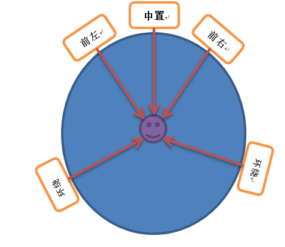

# audio定义
1. Audio指人说话的声音频率，通常指300Hz-3400Hz的频带

# 重要参数
缩写|全称|---
---|---|---
采样率|Sampling Rate|8KHz、44.1KHz、48KHz
采样深度|Bit Depth|8、16、24、32(浮点)
编码分类|波形编码(例如PCM)、参数编码、混合编码
音频数据码率(bps)|采样率 * 采样深度 * 声道数

# Audio编码格式分类
格式|介绍
---|---
pcm|无损编码,音频原始数据
wav|
mp3|
aac|
wma|
m4a|
ogg|
flac|无损编码
aiff|
ac-3(dolby digital）|杜比数码
dts(Digital Theater System)|数字剧院音效
dolby TrueHD(HD)|专为高清光盘媒体所开发的下一代无损压缩技术
dolby digital plus（HD）|杜比数字+

    dts hd master audio（HD），
    dts hd high resolution audio（HD）
    dts hd low bit rate（HD）
## 多声道音频的分类
缩写|全称|含义
---|---|---
C|center|中心
L| left front|前左
R| Right Front|前右
LS | Left surround|左环绕
rs | right surround|右环绕
s | surround(单个环绕声道）|
LB | left back surround|左后环绕
RB | right back surround|右后环绕
CS | Center surround|中心环绕
1. 带LFE声道的分法：根据码流中实际的通道数分X的值为0/1，0表示不带LFE通道，1表示含LFE通道
1X→C 如1.0为C,1.1为C+LFE
2.x->L+R
3.x->C+L+R
4x->L+R+LS+RS
5.x->L+R+C+LS+RS
6.x->L+R+C+LS+RS+Cs
7.x->L+R+C+LS+RS+LB+RB

    

